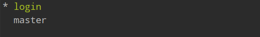
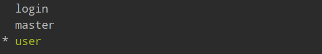
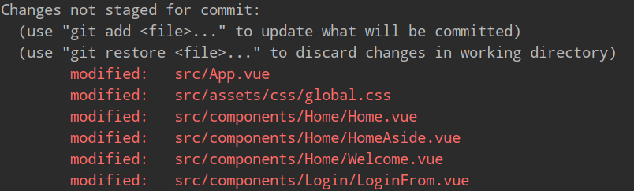
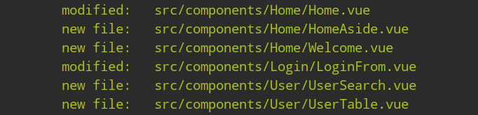
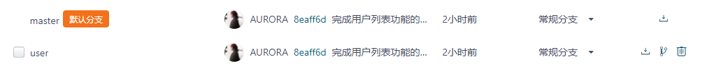

## Git创建本地子分支并推送到云端仓库

通常在开发一个新功能时，需要创建一个子分支，开发完成后再合并到总分支master上。

### 准备
::: tip
已经创建好了并同步了github/码云的云端仓库
:::

### 一. 创建本地分支

1.  查看本地仓库分支。

```
git branch
```


::: warning
master为总分支，带*的为当前所在的分支。
:::
2. 创建名为user的子分支

```
git checkout -b user
```

创建完毕后，它会自动的切换到user分支上，输入`git branch`命令查看



...(｡ì _ í｡)

### 二. 提交到本地仓库

1. 检查user分支上文件的状态

```
git status
```
::: tip
可以看到位于user分支上，和新增与被修改的文件
:::


2. 添加到暂存区

```
git add .
```

再次执行`git status`，查看状态



3. 提交到本地的仓库并添加一个提交消息

```
git commit -m "完成用户列表功能的开发"
```

完成后，执行`git status`，查看状态，发现该分支是干净的！说明已经成功提交。


::: warning
此时，还需要给云端仓库添加user这个子分支。(ŎдŎ；)
:::
### 三. 推送到云端仓库

1. 执行一次`git branch`确认当前位于user分支上。

2. 由于是第一次推送，需要创建一个云端分支，同时推送。

```
git push -u origin user
```
::: tip
这样就把本地当前子分支user推送到了云端仓库下的user分支上。
:::

::: danger
但是主分支master上并没有更新。
:::
3. 完成主分支的更新

```
git checkout master
```

4. 切换到主分支上

```
git merge user
```

把名为user的分支合并到master上

5. 最后提交

```
git push
```





